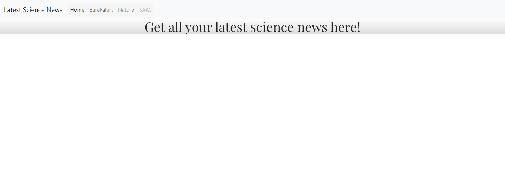
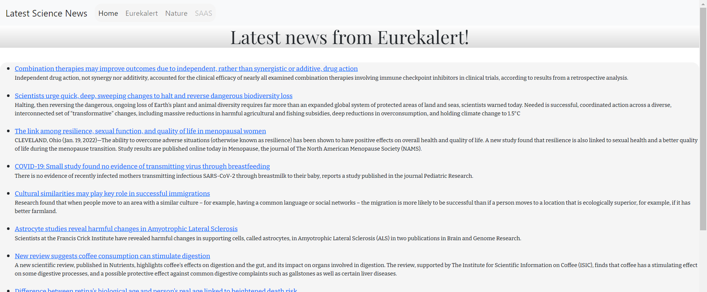

# Science-News-Web-Scraper

###Home Page:

Web scraping script is used to extract news stories from popular (and reliable) science news websites. 

Information from these articles, including: title, summary and links, are then conveyed on to a 
simple webpage for the user to easily access.

###Example tab showing latest articles on Eurekalert:
